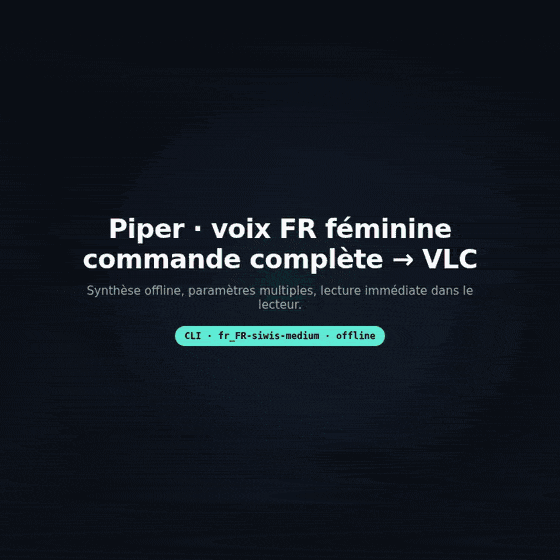
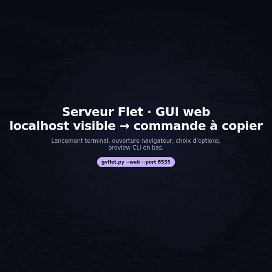

# Generic Voice

<p align="center">
  <a href="LICENSE"></a>
  <a href="https://github.com/JeanSebastienBash/GenericVoice/tags"></a>
  
  
  
</p>

Generic Voice is a text-to-speech integrator for Linux. It unifies three engines behind one CLI, an interactive terminal menu, and an optional Flet GUI: **Piper** (offline neural), **Edge TTS** (online neural), and **eSpeak** (offline formant).

**We integrate, we don't invent.** Each engine keeps its own strengths; Generic Voice provides one validated parameter surface, WAV export, optional Edge effects/melody stems, and playback helpers.

<p align="center">
  <a href="https://dreamproject.online/prj/genericvoice">Official project page</a> ·
  <a href="SECURITY.md">Security</a> ·
  <a href="CONTRIBUTING.md">Contributing</a> ·
  <a href="doc/USER_DOCUMENTATION.md">User guide</a>
</p>

---

## Project status

> **Generic Voice 1.1 — feature-complete.** The MVP is finished and stable for its intended local Linux use (CLI-first, text-to-speech). There is no schedule of regular feature updates. Obvious bugs may still be fixed case by case. Further product context lives on the [official project page](https://dreamproject.online/prj/genericvoice).

---

## What it looks like

<p align="center">
  <table>
    <tr>
      <td valign="top" width="50%">
        
        <p align="center"><sub>CLI Piper · voix FR · multi-paramètres → WAV → VLC</sub></p>
      </td>
      <td valign="top" width="50%">
        
        <p align="center"><sub>Flet web · localhost:port · options GUI → commande à copier</sub></p>
      </td>
    </tr>
  </table>
</p>

---

## Installation

Requirements: **Linux** (Ubuntu/Debian recommended), **Python 3.10+**, disk space for Core Piper voices, and network only if you use Edge TTS.

```bash
git clone https://github.com/JeanSebastienBash/GenericVoice.git
cd GenericVoice
python3 -m venv venv
source venv/bin/activate
pip install -r requirements.txt
python3 py/gvcorevoices.py
python3 py/gv.py --list-engines
```

If system packages are missing, install them with your OS tools, then run dependency checks as a normal user:

```bash
python3 py/gv.py --auto-fix
python3 py/gv.py --auto-fix --system-os ubuntu
```

Do **not** run the whole application under `sudo`.

---

## Quick usage

```bash
# Piper (offline)
python3 py/gv.py --tts piper --voice fr_FR-siwis-medium --text "Hello world"

# Edge (online — text leaves the machine)
python3 py/gv.py --tts edge --voice fr-FR-DeniseNeural --text "Bonjour"

# eSpeak (offline, lightweight)
python3 py/gv.py --tts espeak --text "Quick test"

# Edge effects / melody stems
python3 py/gv.py --tts edge --text "Welcome" --voice-effect echo
python3 py/gv.py --tts edge --text "Intro" --melody --duration 15

# Interactive menu / GUI
python3 py/gv.py
python3 py/gvflet.py
python3 py/gvflet.py --web --port 8555
```

Generated files land under `output/` as `YYYYMMDD_HHMMSS_<type>.wav` (or your `--output` basename with `_voice` / `_mix` suffixes).

---

## Engines

| Engine | Connection | Typical rate | Notes |
|--------|------------|--------------|-------|
| Piper | Offline | 22 kHz | Core ships 5 voices (FR, EN, DE, ES, IT) |
| Edge | Online | 48 kHz | Best quality; effects + melody; text is transmitted remotely |
| eSpeak | Offline | 22 kHz | Fast formant fallback; many languages |

---

## Interfaces

1. **CLI** — `py/gv.py` with validated parameters.
2. **Interactive menu** — same process when launched without synthesis args.
3. **GUI** — `py/gvflet.py` (Flet 0.84), six tabs mirroring the CLI.

---

## Documentation

This README is the public entry point only (status, install, quick usage, engines). The full product surface is documented elsewhere:

| Audience | Document | Covers |
|----------|----------|--------|
| End users | [User guide](doc/USER_DOCUMENTATION.md) | Installation, engines, CLI examples, GUI, outputs, troubleshooting |
| Integrators / maintainers | [Technical documentation](doc/TECHNICAL_DOCUMENTATION.md) | Architecture, modules, parameter matrix, audio pipeline, tests, dependencies |

Also: [Third-party notices](THIRD_PARTY_NOTICES.md) · [Security](SECURITY.md) · [Contributing](CONTRIBUTING.md)

> **Need more than this README?** Start with the [user guide](doc/USER_DOCUMENTATION.md) for day-to-day usage (command reference, Flet GUI, Core voices). Open the [technical documentation](doc/TECHNICAL_DOCUMENTATION.md) for the CLI parameter matrix, synthesis pipeline, and module map. Nothing essential is “missing” here — it lives in those two guides on purpose.

---

## Risks and responsible use

- Edge TTS is a cloud path: treat prompts as leaving the host.
- `--auto-fix` may attempt package installs; prefer explicit OS package management and a non-root shell.
- Bundled eSpeak NG components are GPLv3 — see [THIRD_PARTY_NOTICES.md](THIRD_PARTY_NOTICES.md).
- The repository includes Core voice ZIP archives and Piper runtime binaries; keep extracted `.onnx` files and `output/` audio out of accidental commits (already covered by `.gitignore`).
- This line has automated unit/integration tests; GUI and live engine availability still depend on the local machine.

---

## License

Generic Voice application code: [MIT](LICENSE).

Third-party components retain their own licenses — see [THIRD_PARTY_NOTICES.md](THIRD_PARTY_NOTICES.md).

---

Publisher: [DreamprojectAI](https://dreamproject.online/) · Project sheet: [genericvoice](https://dreamproject.online/prj/genericvoice)
